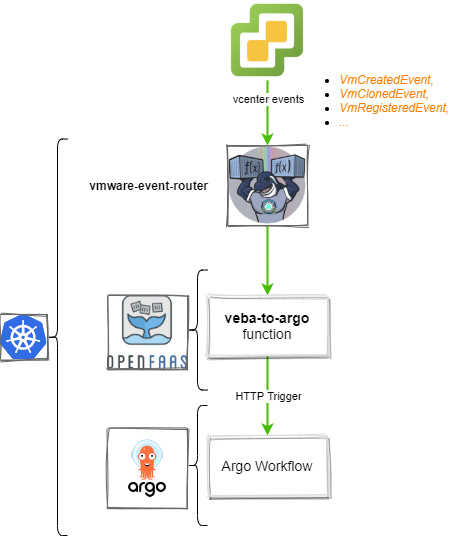

# VEBA to Argo workflow

This is an OpenFaaS function to run an [Argo Workflow](https://argoproj.github.io) based on an event submitted by the 
[VEBA](https://vmweventbroker.io/) (VMware Event Broker) services.

This function can be usefull to manage usecases where *Function-as-a-Service* best-practices **cannot** be applied.

(The above best practices are coming from the VEBA documentation page: [Build Functions](https://vmweventbroker.io/kb/contribute-functions))

* **Single Responsibility Principle**: the Argo workflows can manage multiple responsability by using a step-mechanism.
* **Keep Functions slim**: As said above, multiple steps can produces a more complex behavior
* **Return early**: We are in the *defer or externalize Work* use case by submitting to Argo WF the long processes. 
* **Persistency and Retries**: Argo WF forwarding also enables to persist the incoming event in the Argo control plane and benefit from *retry* action capability.

## How does it works ##

This OpenFaaS function is a simple *forwarder* (or *proxy*) to execute a pre-definied [Worklow Template](https://argoproj.github.io/argo/workflow-templates/)
by providing the incoming cloud-event as an input parameter of the Workflow excecution.



## Quick-start

### Pre-requisites

You need:

* A deployed VEBA instance (appliance based or K8S based): [How-to on vUptime blog](https://vuptime.io/2020/12/17/vmware-event-broker-0.5.0-on-k8s-first-steps/#openfaas-deployment)
* A deployed OpenFaaS instance (+`faas-cli`)
* A deployed Argo instance (+`argo` cli)
* This repository

## Deploy the Argo echoer template WF

```bash
argo template create echoer-argowf.yaml
argo template list

# Expected output
NAME
echoer
```

## Configure the function

### Argo config secret

Copy and customize the `argoconfig.example.yaml` file:

```bash
cp argoconfig.example.yaml argoconfig.yaml
```

```yaml
argoserver:
  server: argo.vlab.lcl
  protocol: http
  namespace: argo
  serviceaccount: argo-svc
  template: echoer
  event_param_name: message
  labels:
    through: openfaas
    coming-from: veba
    foo: bar
```

Deploy this configuration file as a new *faas* secret.

```bash
faas-cli secret create argoconfig --from-file=argoconfig.yaml
faas-cli secret list

# Expected output
NAME
argoconfig
```

### `stack.yaml`

Edit the `stack.yaml` according to your needs:

```yaml
version: 1.0
provider:
  name: openfaas
  gateway: http://openfaas.vlab.local
functions:
  veba-to-argo-echoer:
    lang: python3
    handler: ./handler
    image: lrivallain/veba-to-argo
    environment:
      write_debug: true
      read_debug: true
    secrets:
      - argoconfig
    annotations:
      topic: VmCreatedEvent, VmClonedEvent, VmRegisteredEvent, DrsVmPoweredOnEvent, VmPoweredOnEvent
```

Now we need to pull the OpenFaaS language template for the specified lang in our stack.yml file:

```bash
faas template store pull python3
```

## Deploy the function

```bash
faas-cli deploy -f stack.yml
faas-cli list

# Expected output
Function                        Invocations     Replicas
veba-to-argoi-echoer            0               1
```

You can also check the function from the UI and do a first test by running:

```bash
echo "{'test': 'This is a test message to echo'}" | faas-cli invoke veba-to-argoi-echoer
```

This should produce an excecution of a Worklow based on the echoer template in Argo.


