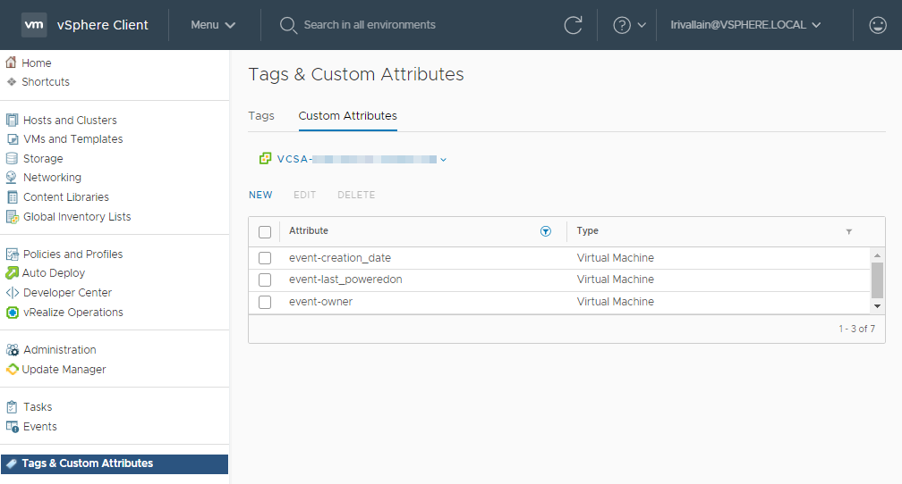
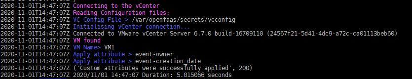
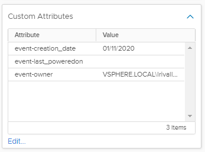
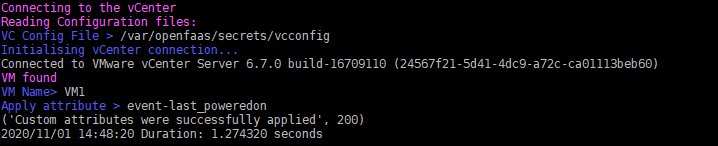
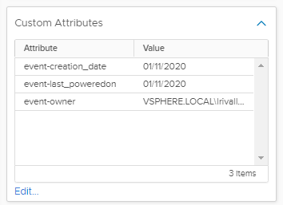

# VM Creation: set attribute(s)

This is an OpenFaaS function to apply custom attributes to a VM object based on an event submitted by the
[VEBA](https://vmweventbroker.io/) (VMware Event Broker) services.

## The use-case

The initial use-case is the following:

We have a lab vCenter with multiple users, multiple projects, PoC etc. And it’s a bit hard to know which VM belongs to which user, and if the project is still active.

A way I found to handle this, is to set Custom Attributes to the VM objects in vCenter, and to populate values when specific event occurs:

* `event-creation_date`: To store the creation date
* `event-last_poweredon`: To store the last powered on date
* `event-owner`: To store the user that created the VM



## Quick-start

### Pre-requisites

You need:

* A deployed VEBA instance (appliance based or K8S based): [How-to on vUptime blog](https://vuptime.io/2020/12/17/vmware-event-broker-0.5.0-on-k8s-first-steps/#openfaas-deployment)
* A deployed OpenFaaS instance (+`faas-cli`)
* A set of custom attributes applicable to VMs like the previous ones.
* This repository

## Configure the function

### Argo config secret

Copy and customize the `vcconfig.example.yaml` file:

```bash
cp vcconfig.example.yaml vcconfig.yaml
```

```yaml
vcenter:
  server: vcsa-fqdn
  user: service-account@vsphere.local
  password: **********
  ssl_verify: false

attributes:
  owner: event-owner
  creation_date: event-creation_date
  last_poweredon: event-last_poweredon
```

Deploy this configuration file as a new *faas* secret.

```bash
faas-cli secret create vcconfig --from-file=vcconfig.yaml
faas-cli secret list

# Expected output
NAME
vcconfig
```

### `stack.yaml`

Copy and edit the `stack.yaml` according to your needs:

```bash
cp stack.yaml attr-stack.yaml
```

```yaml
provider:
  name: openfaas
  gateway: http://openfaas.vlab.local
functions:
  vm-creation-attr:
    lang: python3
    handler: ./handler
    image: lrivallain/veba-vc-vm-creation-attr
    environment:
      write_debug: true
      read_debug: true
      VC_SECRET_NAME: vcconfig
    secrets:
      - vcconfig
    annotations:
      topic: VmCreatedEvent, VmClonedEvent, VmRegisteredEvent, DrsVmPoweredOnEvent, VmPoweredOnEvent, VmPoweringOnWithCustomizedDVPortEvent
```

Now we need to pull the OpenFaaS language template for the specified lang in our stack.yml file:

```bash
faas template store pull python3
```

## Deploy the function

```bash
faas-cli deploy -f attr-stack.yml
faas-cli list

# Expected output
Function                        Invocations     Replicas
vm-creation-attr                0               1
```

## Invoke function

Invocation is now easy: juste create or power-on a VM in your vCenter and the event will be catched by VEBA, forwared to your OpenFaaS function and the code will run, inspecting the `cloudevents` incoming data and doint the expected tasks.

### Follow function invocation

There is two way to follow the function invocation(s).

By using `kubectl` logs and specifing the `openfaas-fn` namespace, the pod name (from above commands), and the `--tail` and/or `--follow` args:

```bash
kubectl logs -n openfaas-fn vm-creation-attr-65d9f75464-lf2sk --tail 100 --follow
# Output:
2020/11/01 14:41:26 Version: 0.18.1     SHA: b46be5a4d9d9d55da9c4b1e50d86346e0afccf2d
2020/11/01 14:41:26 Timeouts: read: 5s, write: 5s hard: 0s.
2020/11/01 14:41:26 Listening on port: 8080
2020/11/01 14:41:26 Writing lock-file to: /tmp/.lock
2020/11/01 14:41:26 Metrics listening on port: 8081
```

Or with `faas-cli` command:

```bash
faas-cli logs vm-creation-attr --tail 100
# Output:
2020-11-01T14:41:26Z 2020/11/01 14:41:26 Version: 0.18.1        SHA: b46be5a4d9d9d55da9c4b1e50d86346e0afccf2d
2020-11-01T14:41:26Z 2020/11/01 14:41:26 Timeouts: read: 5s, write: 5s hard: 0s.
2020-11-01T14:41:26Z 2020/11/01 14:41:26 Listening on port: 8080
2020-11-01T14:41:26Z 2020/11/01 14:41:26 Writing lock-file to: /tmp/.lock
2020-11-01T14:41:26Z 2020/11/01 14:41:26 Metrics listening on port: 8081
```

Both outputs are very similar, so you can use the one that is the more convenient to you.

#### VM creation

In the case of a VM creation, we have the following output:



And the attributes are populated according to the expected behavior:



#### VM powered-On

If we power On a VM:



And the attributes are populated according to the expected behavior:


